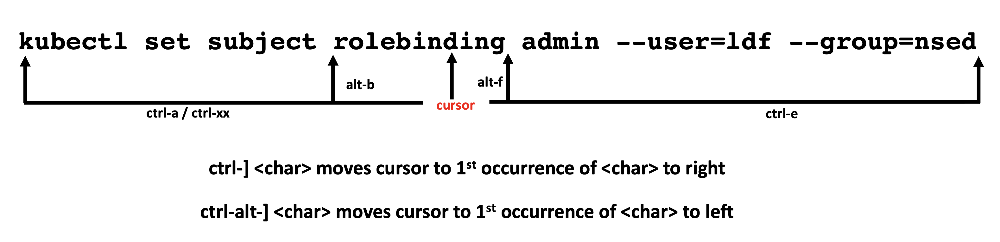
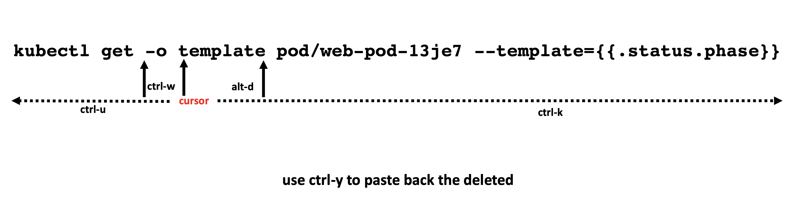
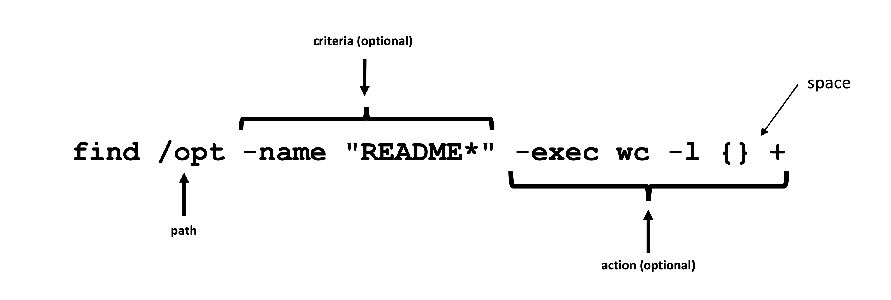
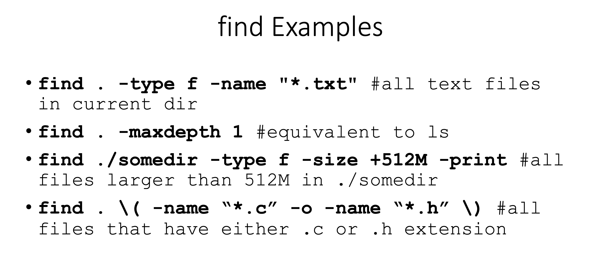
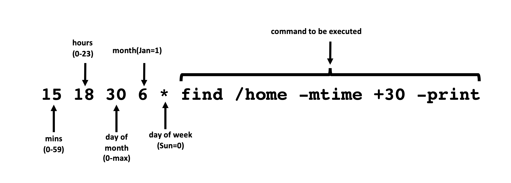

# Linux Commands

## Get familiar with the environment

Listing some useful ones:

• id: know yourself 

• w: who is logged in \(-f to find where they are logging in from\) 

• lsblk: list block storage devices • lscpu: display info about the CPUs 

• lstopo: display hardware topology \(need hwloc, hwloc-gui packages\) 

• free: free and used memory \(try free -g\) 

## Command Navigation

• lsb\_release: distribution info \(try -a\)

Be nice and fly under the radar, eg.: nice -n 19 tar cvzf archive.tgz large\_dir

## Saving some time and hair follicles

!! repeats the last command

• !$ change command keep last argument:  
• cat states.txt \# file too long to fit screen • less !$ \#reopen it with less

• !\* change command keep all arguments:  
• head states.txt \| grep '^Al' \#should be tail  
• tail !\* \#no need to type the rest of the command

## Find Command

## Scheduling Tasks

Source: [Linux Productivity Tools \(2019\) \[pdf\]](https://www.usenix.org/sites/default/files/conference/protected-files/lisa19_maheshwari.pdf)

